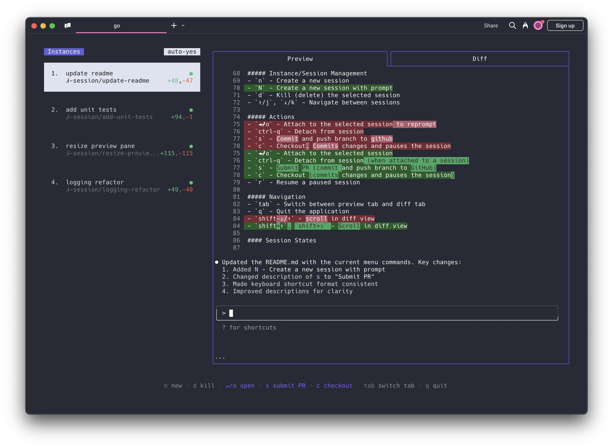

# Claude Squad Windows [](https://github.com/soh963/claude-squad-windows/releases/latest)

[Claude Squad Windows](https://github.com/soh963/claude-squad-windows) is a Windows-native terminal app that manages multiple [Claude Code](https://github.com/anthropics/claude-code), [Codex](https://github.com/openai/codex), [Gemini](https://github.com/google-gemini/gemini-cli) (and other local agents including [Aider](https://github.com/Aider-AI/aider)) in separate workspaces, allowing you to work on multiple tasks simultaneously.

This is a Windows port of the original [Claude Squad](https://github.com/smtg-ai/claude-squad) that replaces tmux dependency with Windows Terminal integration.




### Highlights
- Complete tasks in the background (including yolo / auto-accept mode!)
- Manage instances and tasks in one terminal window
- Review changes before applying them, checkout changes before pushing them
- Each task gets its own isolated git workspace, so no conflicts

<br />

https://github.com/user-attachments/assets/aef18253-e58f-4525-9032-f5a3d66c975a

<br />

### Installation

#### PowerShell (Recommended)

Claude Squad Windows can be installed by running the following command in PowerShell:

```powershell
irm https://raw.githubusercontent.com/soh963/claude-squad-windows/main/install.ps1 | iex
```

This will:
- Download the latest release binary as `cs.exe`
- Install to `%USERPROFILE%\.local\bin\`
- Add the installation directory to your PATH
- Verify Windows Terminal is available
- Create global `cs` command accessible from anywhere

#### Manual Installation

1. Download the latest `cs.exe` from [Releases](https://github.com/soh963/claude-squad-windows/releases)
2. Place it in `%USERPROFILE%\.local\bin\` (or any directory in your PATH)
3. Add the directory to your PATH environment variable:
   ```powershell
   # Add to PATH permanently (requires restart or new terminal)
   $userPath = [Environment]::GetEnvironmentVariable('PATH', 'User')
   [Environment]::SetEnvironmentVariable('PATH', "$userPath;$env:USERPROFILE\.local\bin", 'User')
   ```
4. Ensure Windows Terminal is installed (available from Microsoft Store)

#### Verification

After installation, verify that `cs` is globally accessible:

```powershell
# Test from any directory
cs version
# Should output: claude-squad version 1.0.12
```

### Prerequisites

- [Windows Terminal](https://apps.microsoft.com/store/detail/windows-terminal/9N0DX20HK701) (replaces tmux)
- [gh](https://cli.github.com/) (GitHub CLI)
- [Git](https://git-scm.com/) for version control

### Usage

#### Basic Usage

Claude Squad Windows is now globally accessible! Simply navigate to any git repository and run:

```powershell
# Navigate to your project
cd C:\your-project

# Start Claude Squad Windows
cs
```

#### Command Line Options

```
Usage:
  cs [flags]
  cs [command]

Available Commands:
  completion  Generate the autocompletion script for the specified shell
  debug       Print debug information like config paths
  help        Help about any command
  reset       Reset all stored instances
  version     Print the version number of claude-squad

Flags:
  -y, --autoyes          [experimental] If enabled, all instances will automatically accept prompts
  -h, --help             help for claude-squad
  -p, --program string   Program to run in new instances (e.g. 'aider --model ollama_chat/gemma3:1b')
```

#### Windows Environment Setup

**Default Configuration Location:**
```powershell
# View current config
cs debug

# Config file location: %USERPROFILE%\.claude-squad\config.json
# Example: C:\Users\YourName\.claude-squad\config.json
```

**Environment Variables for AI Assistants:**
```powershell
# For Claude Code (default)
# No additional setup required if using Claude Code CLI

# For OpenAI Codex
$env:OPENAI_API_KEY = "your-openai-api-key"

# For local models (Ollama)
# Ensure Ollama is installed and running: ollama serve
```

#### Launching with Specific AI Assistants

```powershell
# Claude Code (default)
cs

# Aider with OpenAI
cs -p "aider --model gpt-4"

# Aider with local Ollama model
cs -p "aider --model ollama_chat/codellama:13b"

# Custom program
cs -p "your-ai-assistant"
```

#### Making Settings Permanent

Edit the configuration file to set your preferred default:

```powershell
# Find config location
cs debug

# Edit config file (example content):
# {
#   "default_program": "aider --model gpt-4",
#   "auto_yes": false,
#   "daemon_poll_interval": 1000
# }
```

<br />

#### Menu
The menu at the bottom of the screen shows available commands: 

##### Instance/Session Management
- `n` - Create a new session
- `N` - Create a new session with a prompt
- `D` - Kill (delete) the selected session
- `↑/j`, `↓/k` - Navigate between sessions

##### Actions
- `↵/o` - Attach to the selected session to reprompt
- `ctrl-q` - Detach from session
- `s` - Commit and push branch to github
- `c` - Checkout. Commits changes and pauses the session
- `r` - Resume a paused session
- `?` - Show help menu

##### Navigation
- `tab` - Switch between preview tab and diff tab
- `q` - Quit the application
- `shift-↓/↑` - scroll in diff view

### FAQs

#### Failed to start new session

If you get an error like `failed to start new session`, try the following:
1. Ensure Windows Terminal is installed and accessible
2. Update the underlying program (ex. `claude`) to the latest version
3. Check if the program path is correct: `cs debug`
4. Verify git repository: claude-squad must be run from within a git repository

#### Windows Terminal not found

If you get an error about Windows Terminal:
1. Install Windows Terminal from [Microsoft Store](https://apps.microsoft.com/store/detail/windows-terminal/9N0DX20HK701)
2. Or install via winget: `winget install Microsoft.WindowsTerminal`
3. Ensure `wt.exe` is in your PATH

### How It Works

1. **Windows Terminal** to create isolated terminal sessions for each agent (replaces tmux)
2. **git worktrees** to isolate codebases so each session works on its own branch  
3. A simple TUI interface for easy navigation and management
4. **Windows-native** implementation with full feature parity

### License

[AGPL-3.0](LICENSE.md)

### Star History

[](https://www.star-history.com/#smtg-ai/claude-squad&Date)
